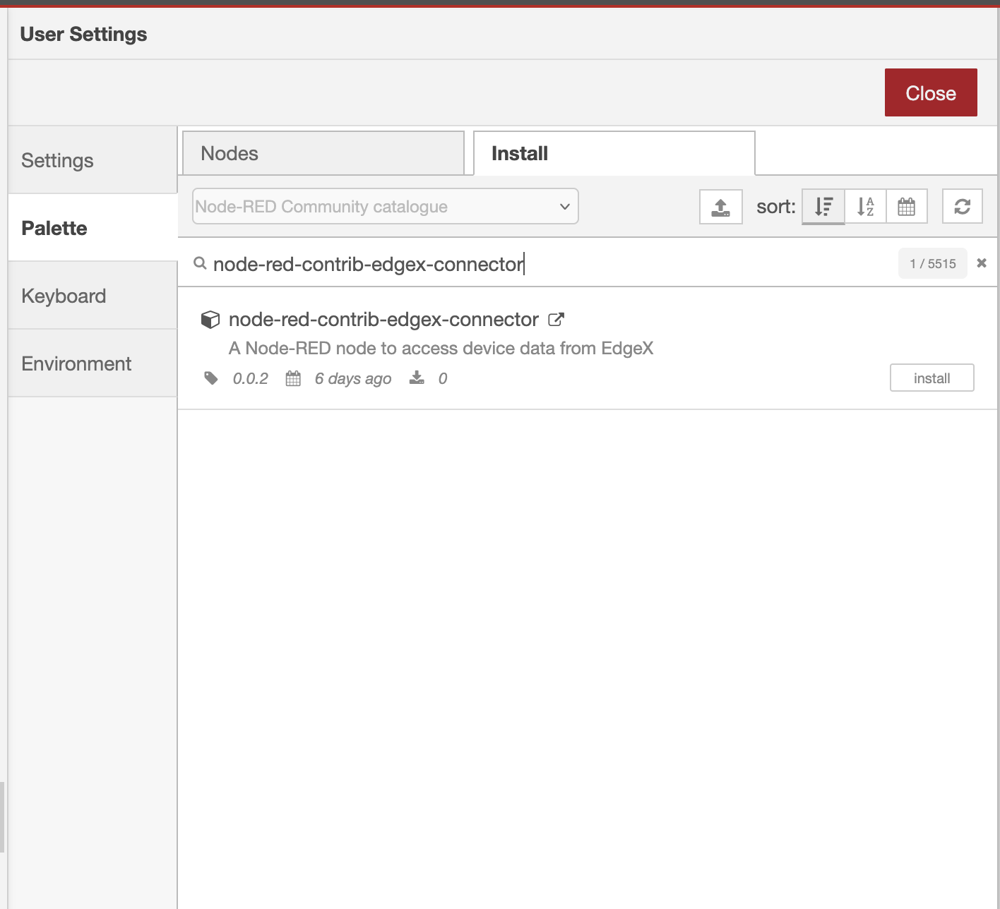

# Node-RED Connector for EdgeX

This Node-RED Connector allows you to seamlessly connect Node-RED flows with [EdgeX Foundry](https://github.com/edgexfoundry) devices and services. It enables you to _read, write, and subscribe_ to device resources while securely managing credentials through [EdgeX Vault](https://docs.edgexfoundry.org/3.2/security/Ch-SecretStore/). Both __secured and unsecured__ modes are supported.

With this connector, you can easily integrate EdgeX data into Node-RED to:

- Perform custom computations on device data  
- Create automation workflows and pipelines  
- Build dashboards and visualizations  
- Enable smart monitoring and control of connected devices  

## Pre-requisite
- Install [EdgeX Foundry](https://www.edgexfoundry.org/start/get-started/)
- Install [Node-RED](https://nodered.org/docs/getting-started/local) either locally or via Docker.

## Installation

### 1. Installing with Node-RED Palette Manager
1. If Node-RED is already installed, open the [Palette Manager](https://nodered.org/docs/user-guide/editor/palette/manager) and search for `node-red-contrib-edgex-connector`. The screenshot of the Palette Manager is shown below:



### 2. Installing with npm
1. If Node-RED is already installed locally, then run the following commands:
```bash
cd ~/.node-red
npm install node-red-contrib-edgex-connector
```

2. Then restart Node-RED. The EdgeX node will appear in the Node-RED palette.

> **Note:** If you encounter an `EACCES: permission denied` error:  
> - **Linux/macOS:** Re-run the command with `sudo`.
> - **Windows:** Do **not** use `sudo`. Instead, open Command Prompt with administrative privileges.

### 3. Installing with Docker
1. If Node-RED is running via Docker, then run the following commands:

```bash
docker ps -a --filter="name=<node-red container-name>"
docker exec -it <node-red container-id> npm install node-red-contrib-edgex-connector
```

### 4. Using the Pre-Installed `node-red-contrib-edgex-connector` Docker Compose

There is a separate Docker Compose setup that comes with the `node-red-contrib-edgex-connector` module pre-installed. Please follow the instructions provided [here](./docker/README.md).

## Usage

The Node-RED connector supports three operation modes for interacting with EdgeX Foundry devices and services: **Read**, **Subscribe**, and **Write**.  

### Read Mode
- Fetches the latest data from selected device resources.  
- Multiple resources can be selected, and each will appear as a separate output port.
- If a device command is selected, all resources within that command are exposed as outputs.
- Output ports are labeled with their corresponding resource names.
- Typically triggered using an **Inject** node.

### Subscribe Mode
- Subscribes to real-time events from device resources via the EdgeX **MQTT** message bus.
- If a device command is selected, all resources within that command are exposed as outputs.
- Output ports are labeled with their corresponding resource names.
- Can also be activated using an **Inject** node.

### Write Mode
- Sends values to a single device resource.
- The input port is labeled with the selected resource name.
- The node expects `msg.payload` in **JSON Object format**, where keys are resource names and values are the data to write.

#### Example Input
```json
msg.payload = {
  "AHU-TargetTemperature": "28.5", 
  "AHU-TargetBand": "4.0" 
}
```

> **Note:**  This node has been validated only with Dockerized deployments of Node-RED and EdgeX.

Below shows a working demonstration of the `node-red-contrib-edgex-connector` interacting with an EdgeX Modbus device service.


## Active Maintainers
- [Chirantan Ghosh](https://github.com/chirantanghosh-se)
- [Mickael Gouet](https://github.com/mickaelgouet-se)

## License
This project is licensed under the [Apache License 2.0](./LICENSE).